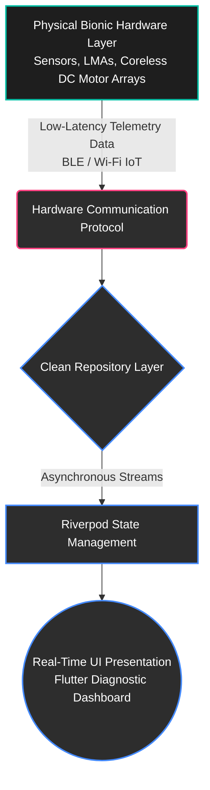

# Project AURA – Advanced Upper-Limb Robotic Actuator
### Advanced IoT Ecosystem & Real-Time Telemetry Diagnostic Platform

Project AURA (Advanced Upper-Limb Robotic Actuator) is a cutting-edge bionic prosthetic ecosystem engineered to bridge the gap between high-fidelity hardware actuation and real-time software diagnostics. This repository contains the production-ready software infrastructure, featuring a robust, low-latency cross-platform diagnostic dashboard designed to process and visualize complex hardware telemetry streams.

---

## 🛠️ System Architecture Overview

The AURA ecosystem operates on a strict **Clean Architecture** paradigm, ensuring that low-level hardware communication protocols are entirely decoupled from the presentation layer. This decoupled structure guarantees that the software remains resilient, scalable, and readily adaptable across varying physical microcontroller deployments.

---

## 🎛️ Feature & Module Specifications

### 1. Dual-Phase Firmware Integration & State Management
* **State Isolation:** Powered by **Riverpod**, the diagnostic client separates presentation logic from high-frequency telemetry collection streams.
* **Telemetry Data Processing:** Architectural provisions handle asynchronous data packets tracking multi-axis joint angles, mechanical stress factors, and battery health loops.

### 2. Global Accessibility & Internationalization (i18n)
* **Real-Time Localization Engine:** A custom, ultra-lightweight key-value translation mapping engine allows instant, mid-calibration switching between 6 enterprise languages without frame drops.
* **Supported Languages:** Arabic (Default RTL), English, French, German, Chinese, and Japanese. The UI dynamically mirrors layout geometry (LTR ↔ RTL) instantly upon language toggle.

### 3. Multi-Role Ecosystem Management
* Fully extensible design paths mirror enterprise security protocols, laying out role-based permissions and secure telemetry channels across distinct authorization levels.

### 4. Advanced Diagnostic Visualization
* Implements dynamic UI layers capable of streaming and displaying high-resolution sensory feedback, replicating voxel resolution densities mapping tactile inputs from the prosthetic's e-dermis layers.

---

## 📂 System Schematics (Proprietary Portfolio Variant)

> **⚠️ INTELLECTUAL PROPERTY NOTICE**  
> *The schematics and files below represent a sanitized public portfolio overview. Core proprietary mechanical tolerances, specific electrode grid patterns, internal coil stack winding configurations, and mathematical thresholding algorithms have been **heavily redacted or completely excluded** from this public repository to safeguard Intellectual Property (IP).*

### Module 1: Mechanical Evolution & Myo-Electric Interface
The structural foundation charts the progression from high-density miniature coreless DC motor configurations toward advanced solid-state joints. Embedded myo-electric sensor arrays capture physical intent, feeding high-frequency signals directly into the processing pipeline.

### Module 2: Solid-State Levitation & Advanced Actuation
Employs solid-state linear muscle systems (LMAs) combined with high-precision magnetic positioning feedback loops to achieve fluid, organic actuation profiles while minimizing mechanical wear.

### Module 3: E-Dermis Tactile Sensing Layer & Haptic Matrix
Features a custom-molded haptic voxel-liner that translates complex physical compression matrices into readable real-time telemetry streams, allowing the software dashboard to accurately visualize tactile engagement.

---

## 🚀 Tech Stack

* **Mobile/Desktop Frontend:** Flutter (Dart)
* **State Management & Architecture:** Riverpod + Clean Architecture (Presentation, Domain, Data)
* **Backend Framework / API Engine:** Django REST Framework (Python) / Laravel (PHP)
* **Database Management:** MySQL / Firebase Firestore (Real-time synchronization)
* **Development & Hardware Simulation Environment:** Linux, macOS, Git, Postman
